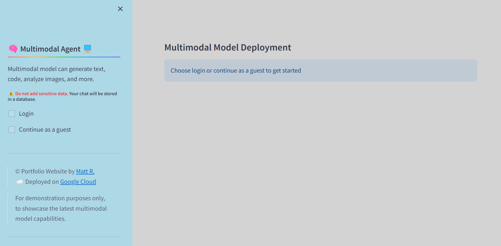
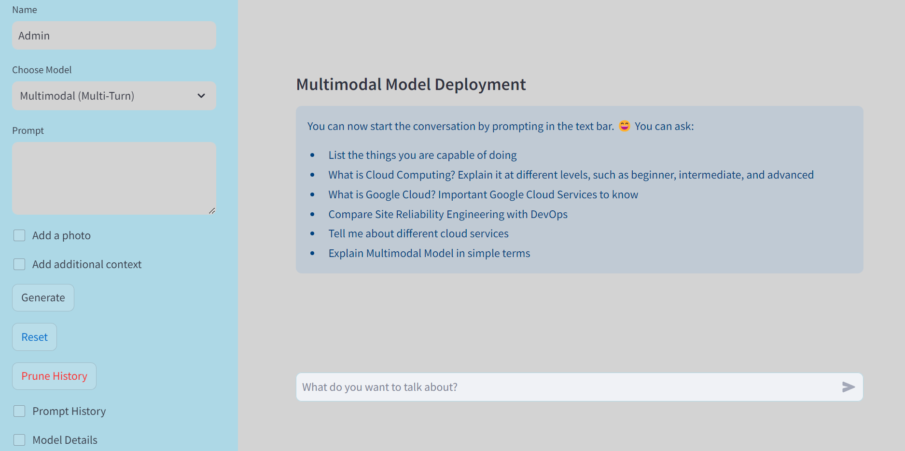

# Multimodal Model Deployment
* Check out the deployed web app here: https://mattcloudtech.com/Agent

## Overview
* This project demonstrates how to build, deploy, and test a web app using a multimodal model.

---
## Objective
* To evaluate the capabilities of the new multimodal model
* To develop web apps and cli using the multimodal model
* To integrate a database for storing prompts and output history
* To deploy the new multimodal model using Google Cloud services

---
## Multimodal
* What are Multimodal Models?
    - Multimodal Models are capable of understanding and generating text, code, images, videos, and more.

---
## Tech Stack
* Google Cloud, Vertex AI Models, Python, Streamlit, PostgreSQL, Psycopg

---
## Prerequisite
* Google Cloud Account
* Google Cloud Owner Role

---
## Setup / Getting Started

### For Multimodal Agent / Chatbot (One-Turn / Multi-Turn)
```sh
# Use Cloud Shell, Compute Engine Instance, or Vertex AI Workbench, or Local IDE
# Make sure to authenticate gcloud command

# Clone the repository
git clone <REPO NAME>

# Set the environment variables; Change the variables according to your needs
source app-env.sh

# Deploy the app using Google Cloud Services
sh app-infra-automation.sh

# For development purposes
sh app-dev.sh

# To test the database connection and app availability
make run_test

# Cleanup
sh app-cleanup.sh
sh app-dev-cleanup.sh

---
# Alternatively, use makefile
# Set the environment variables
source app-env.sh

# Deploy the app using Google Cloud Services
make infra_setup

# For development purposes
make run_dev

# To test the database connection and app availability
make run_test

# Cleanup
make cleanup
make run_dev_cleanup

```

### For AI-Powered Toolkit for Cloud and Tech and Multimodal in Terminal (CLI)
```sh
# AI-Powered Toolkit for Cloud and Tech
sh app-toolkit.sh 
# Cleanup
sh app-toolkit-cleanup.sh

# Using Multimodal in Terminal (CLI)
cd app-cli
# README.md
# Cleanup
sh app-cli-cleanup.sh
```

---
## Screenshot (Multimodal Agent / Chatbot)






---
## Resources
* Multimodal Model Deployment Repository: https://github.com/mregojos/GCP-LLM-Deployment
* Deployed Web App: https://mattcloudtech.com/Agent
* Model Deployment Web App Repository: https://github.com/mregojos/model-deployment
* Google Cloud Vertex AI https://cloud.google.com/vertex-ai 

---
## Disclaimer
* This project is for demonstration purposes only.
* The models in the project are works in progress and may have biases and errors.
* The author of the project is not responsible for any damages and losses resulting from the use of this project.
* This project is not endorsed or affiliated with Google Cloud Platform.