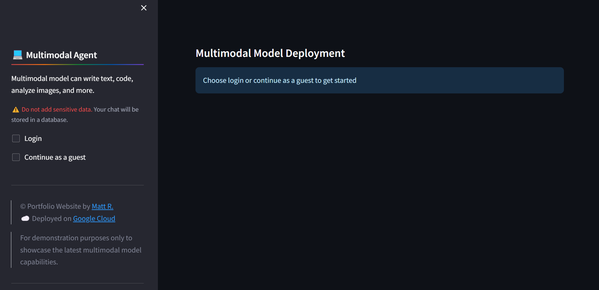

# Multimodal Model Deployment

---
## Objective
* To test the new multimodal model capabilities
* To develop web apps and cli using the multimodal model
* To add database for storing prompts and outputs history
* To deploy the new multimodal model using GCP services

---
## Multimodal
* What is Multimodal model?
    - Multimodal Model can understand and generate text, code, images, videos, and more.

---
## Tech Stack
* Google Cloud, Vertex AI Models, Python, Streamlit, PostgreSQL, Psycopg2

---
## Prerequisite
* Google Cloud Account
* Google Cloud Owner Role

---
## Setup

### For Multimodal Agent / Chatbot (One-Turn / Multi-Turn)
```sh
# Environment Variables
source app-env.sh

# Deployment (Google Cloud Services)
sh app-infra-automation.sh

# Dev
sh app-dev.sh

# Test
make run_test

# Cleanup
sh app-cleanup.sh
sh app-dev-cleanup.sh

---
# Using makefile
# Environment Variables
source app-env.sh

# Deployment (Google Cloud Services)
make infra_setup

# Dev
make run_dev

# Test
make run_test

# Cleanup
make cleanup
make run_dev_cleanup

```

### For AI-Powered Toolkit for Cloud and Tech and Multimodal in Terminal (CLI)
```sh
# AI-Powered Toolkit for Cloud and Tech
sh app-toolkit.sh 
# Cleanup
sh app-toolkit-cleanup.sh

# Using Multimodal in Terminal (CLI)
cd app-cli
# README.md
# Cleanup
sh app-cli-cleanup.sh
```

---
## Screenshot (Multimodal Agent / Chatbot)




---
## Resources
* Multimodal Model Deployment Repository: https://github.com/mregojos/GCP-LLM-Deployment
* Deployed Web App: https://mattcloudtech.com/Agent
* Model Deployment Web App Repository: https://github.com/mregojos/model-deployment