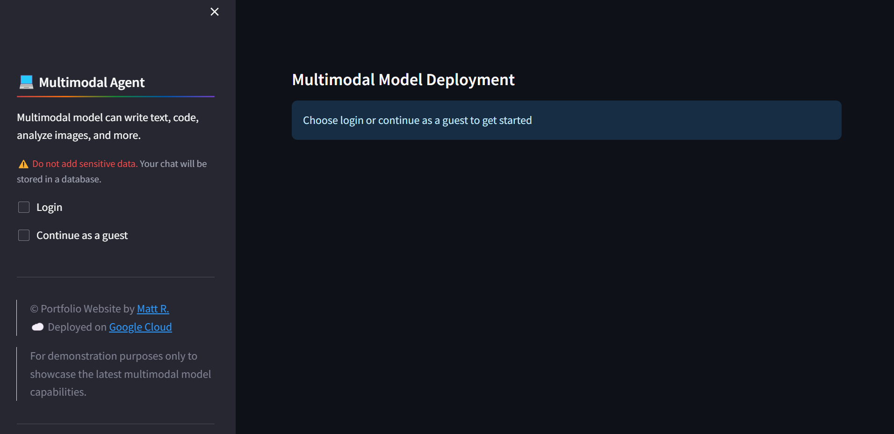

# Multimodal Model Deployment

---
## Objective
* To test the new multimodal model capabilities
* To deploy the new multimodal model using GCP services

---
## Prerequisite
* Google Cloud Account
* Google Cloud Owner Role

---
## Setup
```sh
# Environment Variables
source env*

# Infra
sh infra*

# Dev
sh app-dev-multimodal.sh

# Test
make run_test

# Cleanup
sh cleanup-multimodal.sh

---
# Using makefile
# Environment Variables
source env*

# Infra
make infra_setup

# Dev
make dev_setup

# Test
make run_test

# Cleanup
make cleanup
```

---
## Screenshot




---
## Resources
* Multimodal Model Deployment Repository: https://github.com/mregojos/GCP-LLM-Deployment
* Site Model Deployment Repository: https://github.com/mregojos/model-deployment